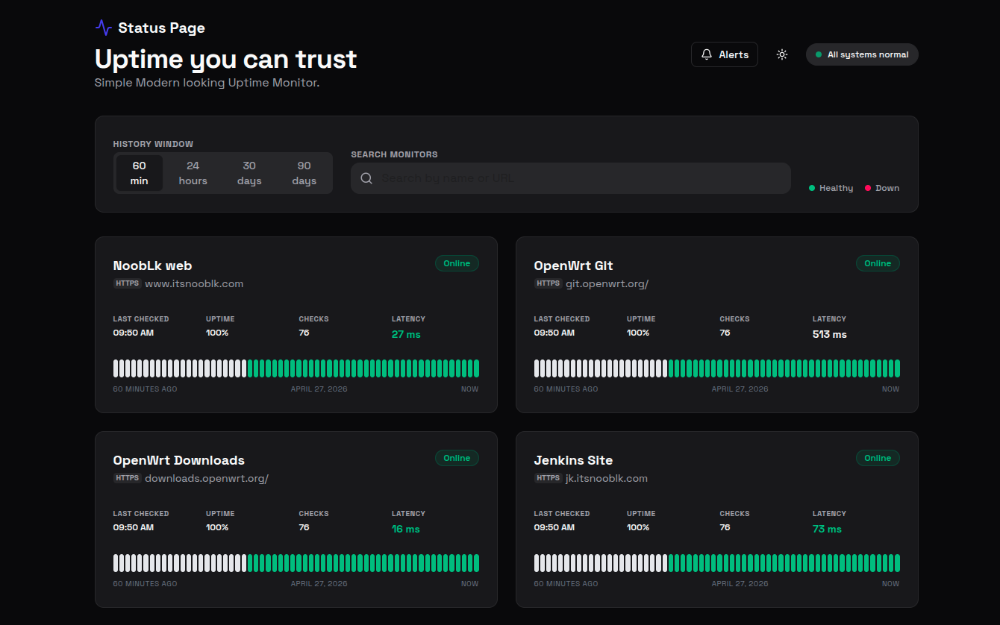

<div align="center">
  

# Status Page – Uptime Monitor

**Modern status dashboard with live checks, downtime alerts, and a clean UI.**

[](https://nodejs.org/)
[](https://expressjs.com/)
[](https://www.sqlite.org/index.html)
[](https://www.docker.com/)
[](http://www.gnu.org/licenses/agpl-3.0)

[Live Demo](https://status.itsnooblk.com)

</div>

---

## UI Preview



---

### What is included

- Live monitor checks with configurable intervals and timeouts.
- SQLite storage with rolling 30‑day history.
- Uptime bars + downtime window overlays.
- Alerts page with mark‑as‑read.
- Search + suggestions for monitors.
- Light/Dark theme toggle.

---

## Features

### Monitoring
- Per‑monitor check interval and timeout in `config.js`.
- HTTP status and error details stored per check.
- Automatic uptime percentage calculation.

### UI/UX
- Clean card layout with timeline visualization.
- Recent downtime details (status code, error, duration).
- Search and quick suggestions for monitors.

### Operations
- Docker compose support with persistent SQLite volume.
- Timezone configurable via `TZ` in compose.
- Simple Node + Express server.

---

## Quick Start

### Option 1: Local dev

```bash
npm install
npm start
```
Open `http://localhost:3000`.

### Option 2: Docker Compose

```bash
docker compose up --build
```

If you want container timezone:

```yaml
environment:
  - TZ=Asia/Colombo
```

---

## Configuration

Edit `config.js`:

```js
const intervalSeconds = 30;
const timeoutMs = 8000;

module.exports = [
  {
    id: "my-web",
    name: "My Website",
    url: "https://example.com",
    intervalSeconds,
    timeoutMs,
  },
];
```

---

## Pages

- Main dashboard: `/` (served from `public/index.html`)
- Alerts page: `/alerts.html`

---

## Project Structure

```
status-page/
  config.js            # Monitor configuration
  data/                # SQLite database (created on first run)
  public/              # Frontend assets
  server/              # API + monitoring service
```

---

## Troubleshooting

- No checks appearing: confirm `config.js` URLs are reachable and server is running.
- Alerts empty: only downtime windows appear (consecutive failed checks).
- Docker timezone: set `TZ=Asia/Colombo` under the service environment.

---

## Contributing

1) Fork and create a feature branch. 2) Make changes with tests or manual checks. 3) Update docs when behavior changes. 4) Open a PR with a clear summary.

---

## 📝 License

This project is licensed under the **GNU Affero General Public License v3.0** (AGPL-3.0).
See [LICENSE](LICENSE) for full details.

---

<div align="center">

**Developed by nooblk**

[⬆ Back to top](#status-page--uptime-monitor)

</div>
