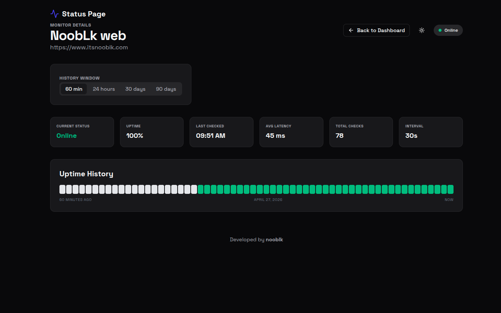

# Status Page – Uptime Monitor

**Modern status dashboard built with Next.js, featuring live checks, downtime alerts, and a clean UI.**

[](https://nextjs.org/)
[](https://www.typescriptlang.org/)
[](https://tailwindcss.com/)
[](https://www.sqlite.org/index.html)

---

## Preview




---

## Quick Start

### Local Development

```bash
npm install
npm run dev
```
Open [http://localhost:3000](http://localhost:3000).

### Production Build

```bash
npm run build
npm run start
```

---

## Features

- **Admin Panel (no code required)**: Add, edit, enable/disable, and delete monitors and change all settings from a protected `/admin` UI — no code edits or redeploys. Changes are picked up by the monitoring loop live.
- **Multiple monitor types**: HTTP/HTTPS (status code + optional keyword match), TCP port, and ICMP ping.
- **Live Monitoring**: Background checks with configurable intervals and timeouts.
- **Modern UI**: Clean dashboard built with Next.js App Router and Tailwind CSS.
- **Timeline View**: Visual history of site health and latency.
- **Configurable branding**: Site name, tagline, and footer editable from the admin UI.
- **Notifications**: Email, Google Chat, MS Teams, and Telegram — editable from the admin UI (DB-backed, with env fallback).
- **Data retention**: Old check history is auto-pruned on a configurable schedule.

---

## Admin Panel

Everything is now managed at runtime — `lib/config.ts` only seeds the initial monitors on first run.

1. Set an admin password and session secret (see [Environment Variables](#environment-variables)).
2. Visit **`/admin`** — you'll be redirected to the login page.
3. Log in with `ADMIN_PASSWORD`. From there you can:
   - **Monitors**: add/edit/delete HTTP, TCP, or Ping monitors; toggle enabled; set interval/timeout.
   - **Settings**: branding (name/tagline/footer/meta), notification channels, data retention, and change the admin password.

Monitors and settings are stored in the SQLite database (persisted via the Docker volume), so they survive restarts. Deleting a monitor keeps its historical uptime data.

> ICMP **Ping** monitors require the `NET_RAW` capability in Docker (already set in `docker-compose.yaml`) and the `iputils` package (installed in the `Dockerfile`).

---

## Environment Variables

Copy `sample.env` to `.env` and adjust:

```env
# Admin panel (required for /admin)
ADMIN_PASSWORD=changeme
SESSION_SECRET=a-long-random-stable-string

# Notifications (initial defaults — also editable from the admin UI)
EMAIL_ENABLED=true
EMAIL_HOST=smtp.example.com
EMAIL_USER=user@example.com
EMAIL_PASS=password
EMAIL_TO=admin@example.com
GOOGLE_CHAT_WEBHOOK_URL=https://chat.googleapis.com/...
TEAMS_WEBHOOK_URL=https://outlook.office.com/...

# Telegram — bot token from @BotFather, chat ID from @userinfobot
TELEGRAM_ENABLED=true
TELEGRAM_BOT_TOKEN=123456:ABC-DEF...
TELEGRAM_CHAT_ID=123456789
```

`SESSION_SECRET` must be a long random string and **stable across restarts** (otherwise active admin sessions are invalidated). The notification env vars are used as field-level fallbacks until you save notification settings in the admin UI.

---

## Project Structure (Feature-First)

- **app/**: Routes, layouts, and metadata.
- **features/**: Domain logic (status monitoring, notifications).
- **components/ui/**: Reusable UI components.
- **lib/**: Cross-feature utilities (database, config, env validation).

---

## License

This project is licensed under the AGPL-3.0 License.
